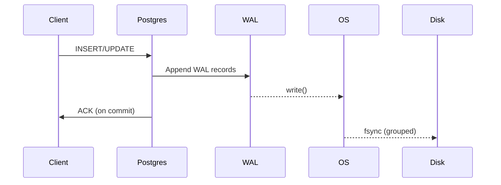

> 本文从工程视角总结 PostgreSQL 写入路径与 Checkpoint 行为，并附上可观测性指标与调优建议。<!--more-->

## 写入路径概览



### 建议
- 降低 `full_page_writes` 代价：使用更快的存储与合理的 `wal_compression`。
- 控制 Checkpoint 抖动：`checkpoint_timeout`, `max_wal_size`, `checkpoint_completion_target`。
- 利用 `pg_stat_wal`, `pg_stat_bgwriter` 进行观测。

## 指标观察（Prometheus）

```sql
-- Example query to aggregate WAL writes per minute
-- (English comments to be friendly for reviewers)
SELECT date_trunc('minute', now()) AS ts, sum(wal_bytes) AS wal_bytes_min
FROM pg_wal_stats()
GROUP BY 1
ORDER BY 1 DESC
LIMIT 60;
```

## 结语
把检查点「摊平」与 WAL 写入「成组」通常能带来明显延迟改善。
